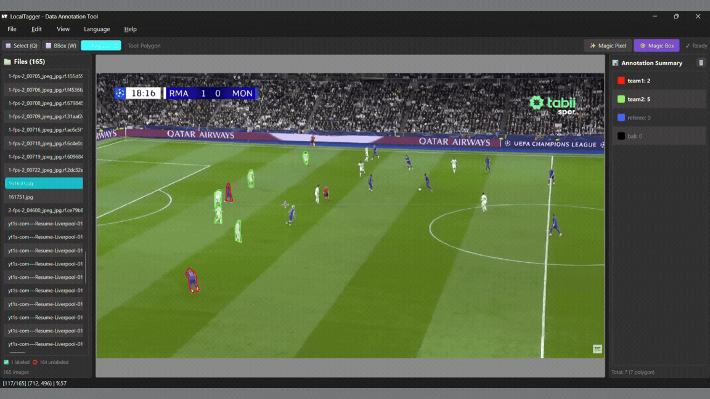
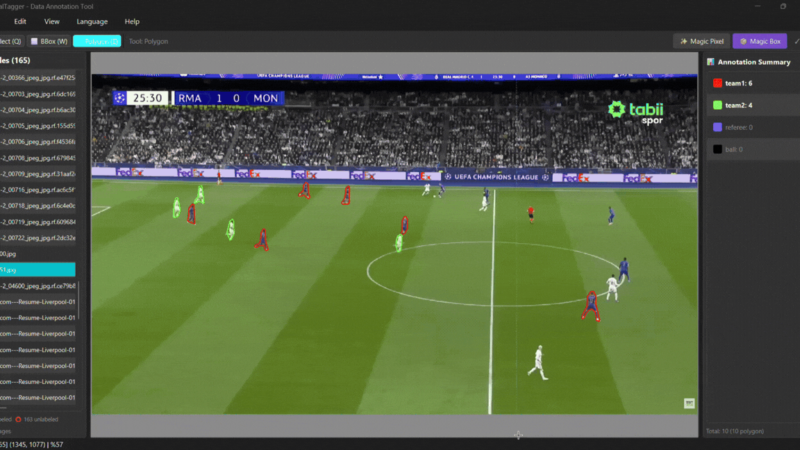

# LocalTagger

<div align="center">
  
  <h3>Professional Image Data Annotation Tool</h3>
</div>

**LocalTagger** is a local-first image annotation application designed for precision and efficiency. It empowers researchers and developers to create high-quality datasets for object detection and segmentation tasks, leveraging advanced AI-assisted tools like **MobileSAM**.

---

## 🚀 Key Features

*   **Versatile Annotation Tools**:
    *   **Bounding Boxes (BBox)**: Rapidly label objects for detection tasks.
    *   **Polygons**: Create precise segmentation masks for complex shapes.
*   **AI-Powered Assistance (MobileSAM)**:
    *   **Magic Box**: Draw a box to automatically detect objects.
        *   *In Polygon Mode:* Generates a precise segmentation mask.
        *   *In BBox Mode:* Snaps a tight bounding box around the object.
    *   **Magic Pixel**: Click to annotate.
        *   *In Polygon Mode:* Segments the clicked object.
        *   *In BBox Mode:* Creates a bounding box around the clicked object.
*   **Workflow Efficiency**:
    *   **Class Management**: Define custom classes with persistent names and colors.
    *   **Smart Navigation**: Use keyboard shortcuts and zoom/pan controls for fluid browsing.
    *   **Multi-Language Support**: Fully localized in **English** and **Turkish**.
*   **Data Compatibility**:
    *   **Import/Export**: Support for **YOLO** and **Pascal VOC** formats.
*   **Robust Data Augmentation**: Multiply your dataset size up to **15x** using various augmentation methods.
*   **Privacy First**: Runs entirely on your local machine—no data is ever uploaded to the cloud.

---

## 🎥 Demos

Experience the power of AI-assisted annotation:

### Magic Box Segmentation

*Demonstrating segmentation labeling using the Magic Box tool. Draw a box, get a mask.*

### Precision & Detail

*Close-up view showing how drawing a Bounding Box triggers the Magic Box to generate a precise polygon.*

---

## 🛠️ Installation Guide

Follow these steps to set up LocalTagger on your local machine.

### Prerequisites
*   **Python 3.10** or higher
*   **Git** (for cloning the repository)
*   **Conda** (Recommended for environment management)

### Step-by-Step Installation

1.  **Clone the Repository**
    ```bash
    git clone https://github.com/yusufsamur/LocalTagger.git
    cd LocalTagger
    ```

2.  **Create a Virtual Environment** (Recommended)

    *Option A: Using Conda (Preferred)*
    ```bash
    conda create -n localtagger python=3.10
    conda activate localtagger
    ```

    *Option B: Using Python venv*
    ```bash
    python -m venv venv
    # Windows
    .\venv\Scripts\activate
    # Linux/Mac
    source venv/bin/activate
    ```

3.  **Install Dependencies**
    ```bash
    pip install -r requirements.txt
    ```
    *This installs core requirements including PySide6 (GUI), OpenCV, Pillow, and OnnxRuntime.*

4.  **Run the Application**
    ```bash
    python src/main.py
    ```

---

## 💻 Usage & shortcuts

Once the application is running, you can use the following shortcuts to speed up your workflow:

| Key | Action |
| :--- | :--- |
| **Q** | Select Tool (Edit Mode) |
| **W** | Bounding Box Tool |
| **E** | Polygon Tool |
| **T** | Toggle Magic Pixel (AI) |
| **Y** | Toggle Magic Box (AI) |
| **A / Left Arrow** | Previous Image |
| **D / Right Arrow** | Next Image |
| **Ctrl + S** | Save Annotations |
| **Ctrl + Scroll** | Zoom In/Out |

---

## 📂 Project Structure

A detailed overview of the project's source code organization:

*   **`src/`**: The root directory for the source code.
    *   **`canvas/`**: Handles the image display, drawing logic, and mouse interactions.
    *   **`core/`**: Contains the core application logic (Project management, data models, SAM AI worker).
    *   **`resources/`**: Stores static assets like icons, documentation media, and AI models.
    *   **`translations/`**: Language localization files (.ts/.qm) for multi-language support.
    *   **`ui/`**: User Interface components.
        *   `dialogs/`: Separate windows for specific tasks (Export, Class Management).
        *   `widgets/`: Reusable UI elements (Class List, Toolbars).
    *   **`utils/`**: Helper functions and utility classes.
    *   **`app.py`**: The main application controller class.
    *   **`main.py`**: The entry point for launching the application.
*   **`requirements.txt`**: List of Python dependencies.
*   **`LICENSE`**: Project license information.

---

## 👥 Author

Developed by [Yusuf Said SAMUR](https://github.com/yusufsamur).

## Third-Party Components

This project uses a model derived from **MobileSAM**, which is licensed under the Apache License 2.0.

- Original project: [MobileSAM](https://github.com/ChaoningZhang/MobileSAM)
- License: Apache License 2.0
- Modifications: The original model was converted to ONNX format for use in this project.

## 📄 License

This project is licensed under the **MIT License**. See the [LICENSE](LICENSE) file for details.
